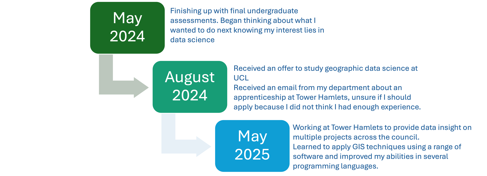
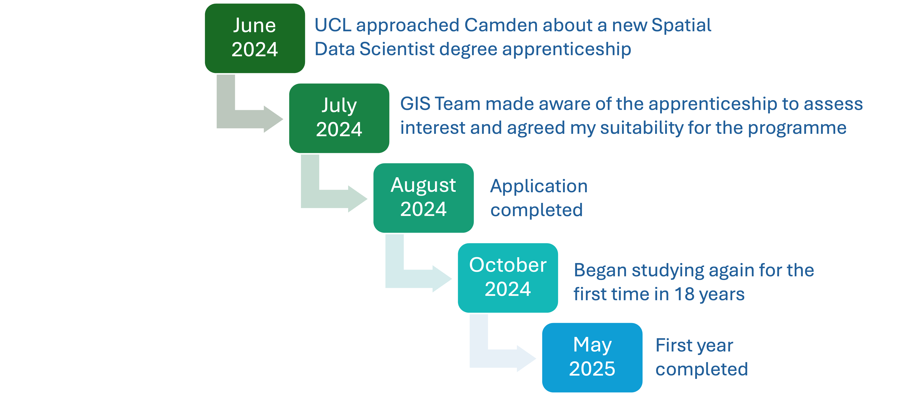
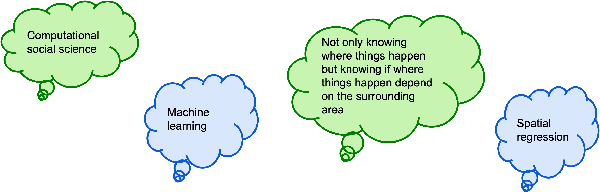
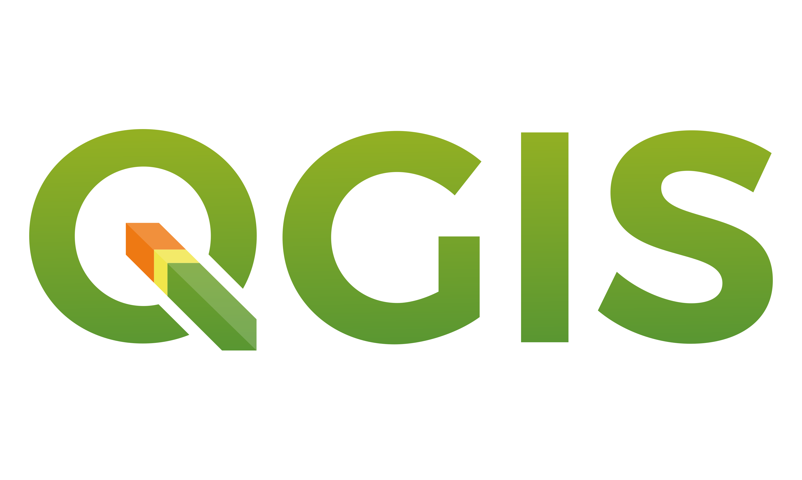
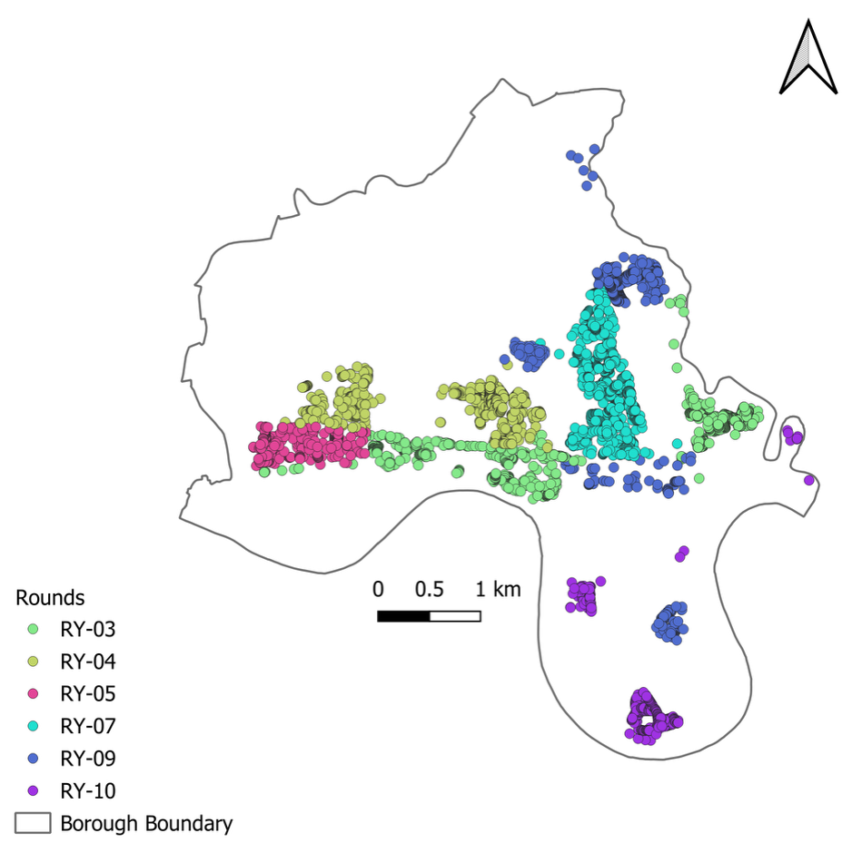
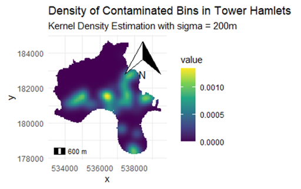
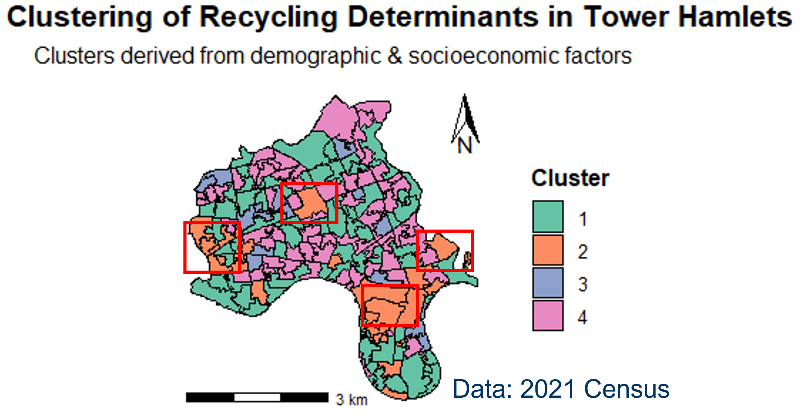
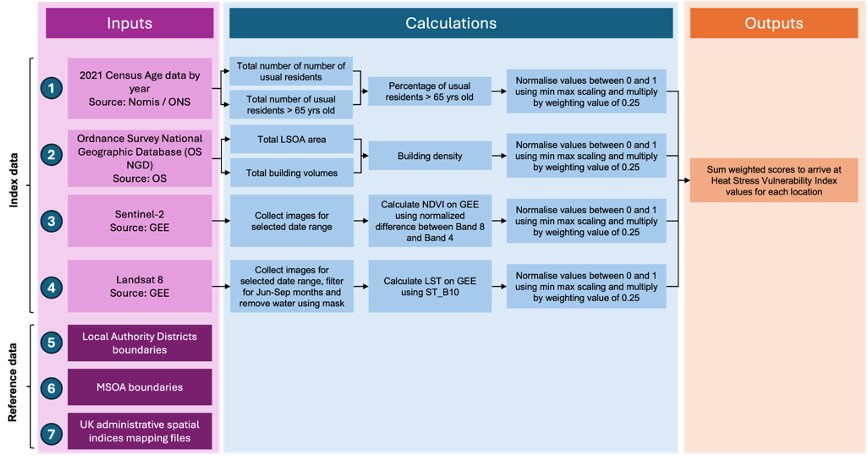

```{r setup, include=FALSE}
options(htmltools.dir.version = FALSE)
knitr::opts_chunk$set(
  fig.width=9, fig.height=3.5, fig.retina=3,
  out.width = "100%",
  cache = FALSE,
  echo = TRUE,
  message = FALSE, 
  warning = FALSE,
  hiline = TRUE
)
```

```{r xaringan-themer, include=FALSE, warning=FALSE}
library(xaringanthemer)
style_duo_accent(
  primary_color = "#035AA6",
  secondary_color = "#03A696",
  inverse_header_color = "#FFFFFF"
)
```

## How we got here (Sadia)



---
## How we got here (Paul)




---

## What is spatial data science

<div style="font-size: 1.2em; line-height: 1.6;">
Spatial data science combines geographic concepts with data analysis to explore, visualise, and model spatial patterns and relationships, enabling insights into real-world issues like urban planning, environmental change and mobility patterns.
</div>

<div style="text-align: right; font-weight: bold; margin-top: 1em;">
Definition: Kings College London
</div>


<br>

<center>

</center>

---

```{r echo=FALSE}
xaringanExtra::use_panelset()

```

## Our Toolbox

.panelset[
.panel[.panel-name[R & RStudio]

<div style="display: flex; align-items: flex-start; font-size: 1.2em; line-height: 1.6;">  <div> <ul> <li> <strong>Open source</strong></li> <li>Statistical and graphical language</li> <li>Ideal for spatial stats, mapping, regression</li> <li><strong>Key packages:</strong> <code>sf</code>, <code>dplyr</code>, <code>ggplot2</code></li> <li><em>Tidyverse</em> brings them all together</li> </ul> </div> </div> ]
.panel[.panel-name[QGIS]

<div style="display: flex; align-items: flex-start; font-size: 1.2em; line-height: 1.6;">  <div> <ul> <li> <strong>Open source </strong></li> <li>Can be used to create and share maps</li> <li>Can be used to analyse and process spatial data</li> </ul> </div> </div> ]
.panel[.panel-name[Python & Docker]
<div style="display: flex; align-items: flex-start; font-size: 1.2em; line-height: 1.6;">

  <!-- Container for two logos side by side -->
  <div style="display: flex; flex-direction: column; margin-right: 25px;">
    
    
  </div>

  <!-- Bullet points -->
  <div>
    <ul>
      <li><strong>Open source</strong></li>
      <li>Popular for automation and web development</li>
      <li><strong>Key packages:</strong> Geopandas, PySAL, Leafmap</li>
    </ul>
  </div>

</div>]
.panel[.panel-name[PostgreSQL & PostGIS]

<div style="display: flex; align-items: flex-start; font-size: 1.2em; line-height: 1.6;">
  
  <div style="margin-right: 25px;">
    
    
  </div>
  
  <div>
    <ul>
      <li><strong>Open source</strong></li>
      <li>Used for spatial queries & data processing</li>
      <li>Supports dashboards & spatial web apps</li>
    </ul>
  </div>

</div>]
.panel[.panel-name[Google Earth Engine]

<div style="display: flex; align-items: flex-start; font-size: 1.2em; line-height: 1.6;">  <div> <ul> <li> <strong>Free for academics</strong></li> <li>Can be used for processing large ammounts of satelite imagery, building spatial applications and environmental monitoring.
</li> <li>APIs in Python and JavaScript</li> </ul> </div> </div> ] ] 

---
## “Everything is related to everything else but near things are more related than distant things” – Waldo Tobler

### We’ve explored:
- **Detecting spatial patterns**

```{r echo=FALSE, results='asis'}
cat('
<div style="display: flex; justify-content: space-between;">
  <div style="text-align: center; width: 35%;">
    
    <p style="font-size: 0.85em; margin-top: 8px;">Contaminated Bins by Collection Round</p>
  </div>
  <div style="text-align: center; width: 50%;">
    
  </div>
</div>
</div>
')

```

---

### Frequency of Exceptions

| Recycling Round | Frequency |
|-----------------|-----------|
| RY-03           | 2143      |
| RY-06           | 879       |
| RY-02           | 810       |
| RY-10           | 653       |
| RY-07           | 293       |
| RY-08           | 67        |
| RY-04           | 61        |
| RY-05           | 37        |
| RY-01           | 6         |
| **Total**       | **4949**  |


---

## Explaining spatial patterns



---

## Heat Stress Vulnerability Index

```{r echo=FALSE, results='asis'}
cat('
<div style="display: flex; justify-content: space-between; align-items: flex-start; gap: 20px; margin-top: 10px;">

  <div style="flex: 1; font-size: 1.2em; line-height: 1.6;">
    <p>App created to identify areas that are at higher risk of heat-related issues.</p>
    <ul>
      <li>Focused on vulnerability (age), building mass, NDVI (vegetation health), and Land Surface Temperature.</li>
      <li>Score calculated for each metric, then a weighted sum for overall index value.</li>
    </ul>
  </div>

  <div style="flex: 1; text-align: center;">
    
  </div>

</div>
')

```

---

## Heat Stress Vulnerability Index - App Demo


<video width="720" height="405" controls>
  <source src="HSVI_Video_clipped.mp4" type="video/mp4">
  Your browser does not support the video tag.
</video>

---


## Learning outcomes and challenges

<div style="font-size: 1.3em; line-height: 1.6;">
  <ul>
    <li>Ask the right questions and understand your data before rushing into analysis or modelling.</li>
    <li>Being patient and organised is important but it is also important to note that you might struggle at the beginning but that is what learning is for.</li>
    <li>Moving from being mainly outcome focused to considering the implications of different techniques.</li>
    <li>Understanding that you don’t need to know everything off by heart</li>
    <li>Red tape (internally)!</li>
  </ul>
</div>


---
## Whats next?
### Automation?

---

## What's next?

<div style="font-size: 1.2em; line-height: 1.6;">
  <ul>
    <li>Implementing remote sensing dataset use within Camden, including within spatial analysis projects</li>
    <li>Critique own spatial analysis results and methodology and providing confidence ratings with analysis</li>
    <li>Speaking to more services about analysis projects and how these could lead into dissertation topics</li>
    <li>Ensuring current Data Analysts consider the power of geospatial in their own analysis.</li>
  </ul>
</div>


---
class: inverse, center, middle
background-color: #008080
color: white

# Thank you!

<div style="font-size: 1.2em; line-height: 1.8; color: white; max-width: 700px; margin: 0 auto;">

Slides created using the R packages:<br>
<a href="https://github.com/yihui/xaringan" style="color: white; font-weight: bold;">xaringan</a> &nbsp;|&nbsp;
<a href="https://github.com/gadenbuie/xaringanthemer" style="color: white; font-weight: bold;">xaringanthemer</a><br><br>

Built with <a href="https://yihui.org/knitr/" style="color: white;">knitr</a>, 
<a href="https://rmarkdown.rstudio.com/" style="color: white;">R Markdown</a>, and 
powered by <a href="https://remarkjs.com/" style="color: white;">remark.js</a>.

</div>

--
